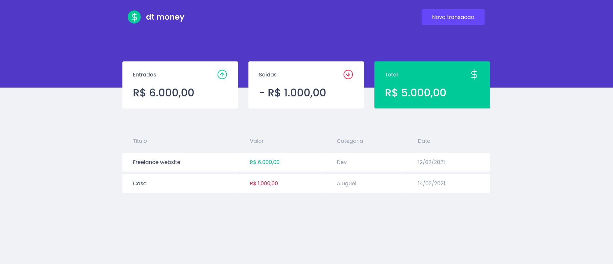

<h1 align="center">
    
    <br>
    Dtmoney ReactJS
</h1>

<h4 align="center">
  A ReactJS app that allows users to financial control.
</h4>
<p align="center">
  

  </a>  
</p>

<p align="center">
  <a href="#Dtmoney-technologies">Technologies</a>&nbsp;&nbsp;&nbsp;|&nbsp;&nbsp;&nbsp;
  <a href="#information_source-how-to-use">How To Use</a>&nbsp;&nbsp;&nbsp;|&nbsp;&nbsp;&nbsp;
  <a href="#memo-license">License</a>
</p>

## :Dtmoney: Technologies

This project was developed at the [RocketSeat [ReacktJs] - Ignite - ](https://www.rocketseat.com.br/ignite) with the following technologies:

- [TypeScript](https://github.com/microsoft/TypeScript/#readme)
- [ReactJS](https://reactjs.org/)
- [Axios](https://github.com/axios/axios)
- [Miragejs](https://miragejs.com)
- [Styled Components](https://styled-components.com)
- [VS Code][vc]

## :information_source: How To Use

To clone and run this application, you'll need [Git](https://git-scm.com), [Node.js v10.16][nodejs] or higher + [Yarn v1.13][yarn] or higher installed on your computer.

From your command line:

```bash
# Clone this repository
$ git clone https://github.com/WalleksMR/dtmoney.git
# Go into the repository
$ cd start
# Install dependencies
$ yarn install
# Run the app (WEB)
$ yarn start
```

## :memo: License

This project is under the MIT license. See the [LICENSE](LICENSE) for more information.

---

Deploy in Github.io: https://walleksmr.github.io/dtmoney/

Made with ♥ by Walleks Miranda : [Get in touch!](https://www.linkedin.com/in/walleks-r-miranda-b291bb1aa/)

[yarn]: https://yarnpkg.com/
[vc]: https://code.visualstudio.com/
